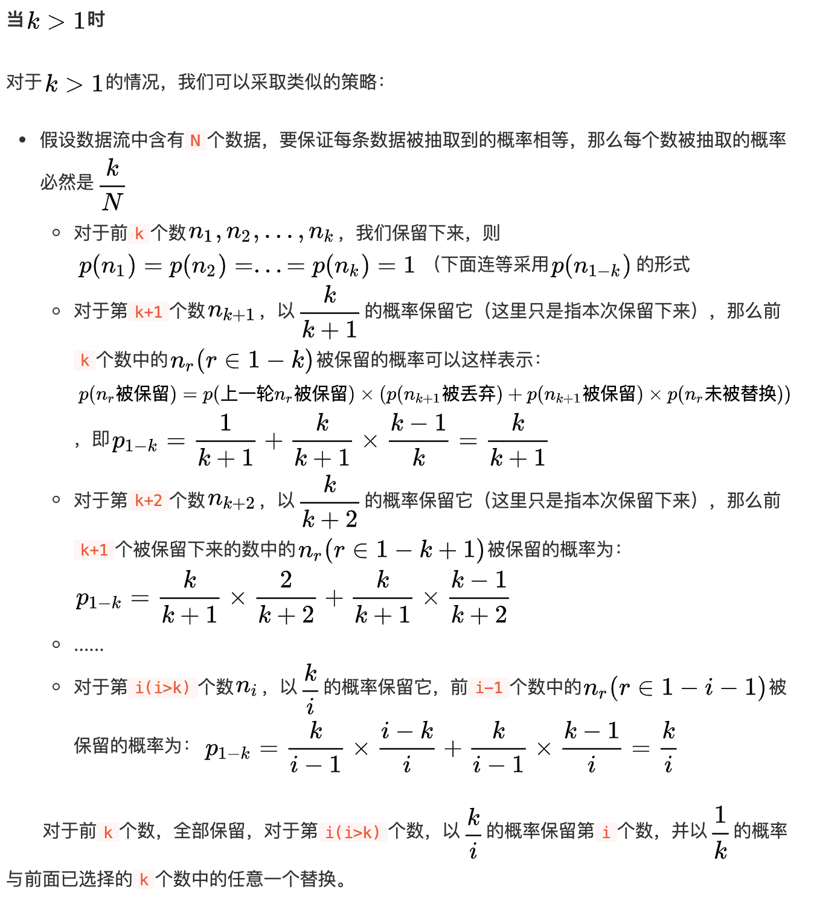

# leetcode
个人刷题总结

刷题部分节选：

+ LeetCode 热门 100 题：[code](src/HOT100)
+ 牛客笔试 必刷 101 题：[code](src/NiukeTOP101)
+ 设计模式 java 实现：[code](src/designPattern)
+ 剑指 Offer 第一版：[code](src/JZOffer)
+ 剑指 Offer 第二版：[code](src/JZOffer2)

## 动态规划 [详细总结](src/summarize/dynamic-programming.md)
具有最优子结构。例如一些背包问题。

## 回溯 [详细总结](src/summarize/backtrack.md)
回溯的本质是穷举所有可能，尽管有时候可以通过剪枝去除一些根本不可能是答案的分支， 但是从本质上讲，仍然是一种暴力枚举算法。

回溯法可以抽象为树形结构，并且是是一颗高度有限的树（N 叉树）。回溯法解决的都是在集合中查找子集，集合的大小就是树的叉树，递归的深度，构成树的高度。

## 贪心
在每一步选择中都采取在当前状态下最好或最优（即最有利）的选择，从而希望导致结果是最好或最优的算法。

## 前缀和
看到连续子串这类问题。

## 滑动窗口
单调队列的思想 [code](src/NiukeTop101/BM45.java)。

## 二分法 [详细总结](src/summarize/binary-search.md)
典型的是归并排序，利用二分思想。
二分查找：适用于有序递增或者递减的数组。
当然，解决很多题的时候，不一定需要整个数组都是有序的。

例如逆序对 [code](src/NiukeTop101/BM20.java)，峰值数，或者是旋转数组的最小值。
例如对于求解峰值数 [code](src/NiukeTop101/BM19.java)，只需要保证峰值的左边是递增的，峰值数的右边是递减的即可。旋转数组的最小值 [code](src/NiukeTop101/BM21.java)也是同样的道理，因为它的左边和它的右边都是递增的。
亦或者是一种归并排序的方法，参见 [MergeSort](src/NiukeTop101/MergeSort.java)。

## 链表
链表这类的题，可以多考虑双指针、快慢指针、栈等方式。

## 树
二叉树：

前序遍历递归与非递归写法 [code](src/NiukeTop101/BM23.java)。

中序遍历递归与非递归写法 [code](src/NiukeTop101/BM24.java)。

后序遍历递归与非递归写法 [code](src/NiukeTop101/BM25.java)。

## 单调栈 [详细总结](src/summarize/monotone-stack.md)
单调栈实际上就是栈，只是利用了一些巧妙的逻辑，使得每次新元素入栈后，栈内的元素都保持有序（单调递增或单调递减）。

## 双指针
双指针指的是在遍历对象的过程中，不是普通的使用单个指针进行访问，而是使用两个指针（特殊情况甚至可以多个），两个指针或是同方向访问两个链表、或是同方向访问一个链表（快慢指针）、或是相反方向扫描（对撞指针），从而达到我们需要的目的。

## 随机抽样
大数据流中的随机抽样问题

即：当内存无法加载全部数据时，如何从包含未知大小的数据流中随机选取k个数据，并且要保证每个数据被抽取到的概率相等。

**当 k = 1 时，** 也就是说，我们每次只能读一个数据。
假设数据流含有N个数，我们知道如果要保证所有的数被抽到的概率相等，那么每个数抽到的概率应该为 1/N。

那如何保证呢？

方案：每次只保留一个数，当遇到第i个数时，以 1/i 的概率保留它， (i-1)/i的概率保留原来的数。

举例说明： 1 - 10

* 遇到1，概率为1，保留第一个数。
* 遇到2，概率为1/2，这个时候，1和2各1/2的概率被保留
* 遇到3，3被保留的概率为1/3，(之前剩下的数假设1被保留)，2/3的概率 1 被保留，(此时1被保留的总概率为 2/3 * 1/2 = 1/3)
* 遇到4，4被保留的概率为1/4，(之前剩下的数假设1被保留)，3/4的概率 1 被保留，(此时1被保留的总概率为 3/4 * 2/3 * 1/2 = 1/4)
以此类推，每个数被保留的概率都是1/N。

证明使用数学归纳法即可。

**当 k=m 时**，也就是说，每次能读取m个数据。和上面相同的道理，只不过概率在每次乘以m而已。

