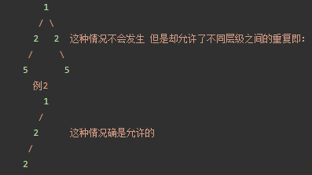

# leetcode
个人刷题总结

## 动态规划
具有最优子结构

## 回溯
解题步骤：1.画出树形图。 2.编码。 3.剪枝。
### 1. 什么时候使用 used 数组，什么时候使用 begin 变量
+ 排序问题，讲究顺序（即 [2, 2, 3] 与 [2, 3, 2] 视为不同列表时），需要记录哪些数字已经使用过，此时用 used 数组;
+ 组合问题，不讲究顺序（即 [2, 2, 3] 与 [2, 3, 2] 视为相同列表时），需要按照某种顺序搜索，此时使用 begin 变量。

### 2. 解集不能包含重复的组合，那么如何去掉一个数组中重复的元素?

很容易想到的方案是：先对数组**升序**排序，重复的元素一定不是排好序以后相同的连续数组区域的第1个元素。

这个避免重复当思想是在是太重要了。
这个方法最重要的作用是，可以让同一层级，不出现相同的元素。即

为何会有这种神奇的效果呢？
首先 cur-1 == cur 是用于判定当前元素是否和之前元素相同的语句。这个语句就能砍掉例1。
可是问题来了，如果把所有当前与之前一个元素相同的都砍掉，那么例二的情况也会消失。
因为当第二个2出现的时候，他就和前一个2相同了。

那么如何保留例2呢？
那么就用cur > begin 来避免这种情况，你发现例1中的两个2是处在同一个层级上的，
例2的两个2是处在不同层级上的。
在一个for循环中，所有被遍历到的数都是属于一个层级的。我们要让一个层级中，
必须出现且只出现一个2，那么就放过第一个出现重复的2，但不放过后面出现的2。
第一个出现的2的特点就是 cur == begin. 第二个出现的2 特点是cur > begin.
## 贪心

## 前缀和

## 滑动窗口

## 分治

## 双指针

## 排序数组的搜索问题
首先想到二分法

## 单调栈

